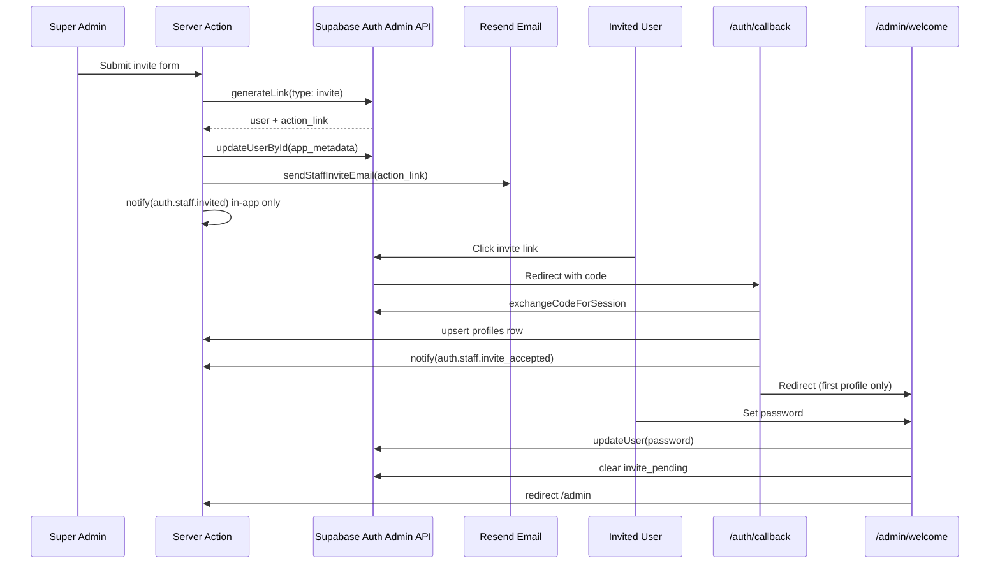

# Staff Invite Flow — No Auth Hooks

**Date:** 2026-06-08  
**Status:** Implemented  
**Principle:** Super-admin orchestrates invites via service role + Resend. No Supabase Auth Hooks.

---

## 1. Overview

Super admins invite staff from **Settings → Staff**. The system:

1. Creates/updates the auth user via `auth.admin.generateLink({ type: 'invite' })`
2. Sets `app_metadata` (`role`, `full_name`, `invite_pending: true`)
3. Sends branded invite email through our `EmailProvider` (Resend)
4. Emits `auth.staff.invited` for in-app admin notifications

No `inviteUserByEmail`, no send-email hook, no webhook reconciliation.

---

## 2. End-to-end flow

---

## 3. States

| State | Detection | UI |
|---|---|---|
| `invite_pending` | Auth user exists, `last_sign_in_at` is null | Staff table shows “Invite pending” + Resend |
| `welcome_required` | `app_metadata.invite_pending === true` after callback | Middleware forces `/admin/welcome` |
| `active` | `last_sign_in_at` set and `invite_pending` cleared | Normal admin access |

---

## 4. Key files

| File | Responsibility |
|---|---|
| `src/app/admin/settings/staff/actions.ts` | `inviteStaffMember`, `resendStaffInvite` |
| `src/lib/auth/staff-invite-email.ts` | Branded invite email via Resend |
| `src/app/auth/callback/route.ts` | Session exchange, profile upsert, invite-accepted emit |
| `src/app/admin/welcome/page.tsx` | First-login password setup |
| `src/utils/supabase/middleware.ts` | Redirect `invite_pending` users to welcome |
| `src/lib/settings/staff-invite-status.ts` | Pending vs active status for staff table |

---

## 5. Security rules

1. Invite links appear **only** in email HTML — never in `notification_events` payload or in-app notifications.
2. Role stored in `app_metadata` (not `user_metadata`).
3. Only super admins can invite, resend, change roles, or deactivate.
4. Invited users cannot access admin routes until callback succeeds.
5. `invite_pending` users are locked to `/admin/welcome` until password is set.

---

## 6. Resend invite

Super admin clicks **Resend invite** for pending users:

- Regenerates invite link via `generateLink`
- Sends fresh email via Resend
- Does not create duplicate auth users

---

## 7. Notifications emitted

| Step | Event | Channels |
|---|---|---|
| Invite sent | `auth.staff.invited` | In-app → all admins |
| Callback success (new profile) | `auth.staff.invite_accepted` | In-app → all admins; email → subject (via worker) |
| Callback success | `auth.callback.succeeded` | Audit only |
| Callback failure | `auth.callback.failed` | Email → subject if known |

---

## 8. Supabase dashboard checklist

- [ ] Disable Supabase Auth Hooks (all types)
- [ ] Disable default Supabase invite/auth emails
- [ ] Confirm Site URL / Redirect URLs include:
  - `{APP_URL}/auth/callback`
  - `{APP_URL}/admin/welcome`

---

## 9. Test plan

1. Super admin invites `staff@test.com` → email arrives from Resend verified domain
2. Staff table shows **Invite pending**
3. Invitee clicks link → lands on `/admin/welcome`
4. Sets password → redirected to `/admin`
5. Staff table shows **Active**
6. Admins see in-app notifications for invite + acceptance
7. Resend invite works for pending user; fails for active user
