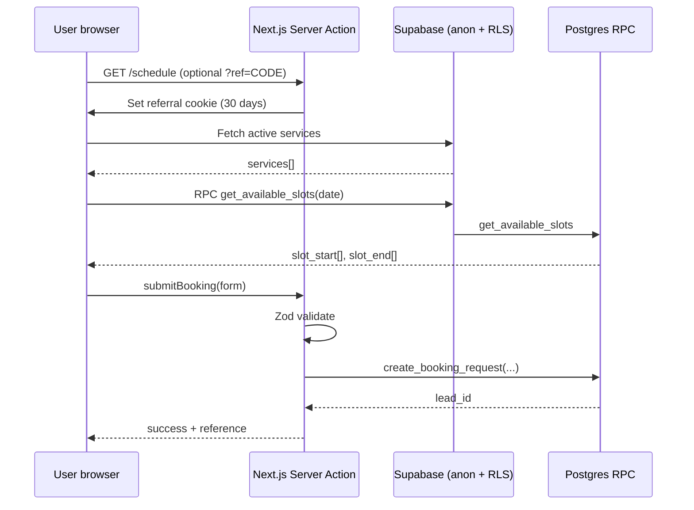

# VANROX Booking Submission & Admin Portal — Design Specification

**Date:** 2026-06-08  
**Status:** Draft for approval  
**Supersedes:** Scheduling sections of `2026-05-25-vanrox-site-design.md` (schema details there are outdated)  
**Source of truth for schema:** `supabase/migrations/20260525000000_initial_schema.sql`

---

## 1. Purpose

This document defines the **end-to-end booking submission system** for VANROX Engineering & Surveying Services, including all **admin portal prerequisites** that must exist before public booking writes real data.

**Scope:** Auth, admin CRUD, scheduler/blockouts, availability engine, public `/schedule` flow, referral attribution, security/RLS, and TDD test strategy.

**Out of scope (later phases):** Email notifications, blog CMS, social media, payment collection, mobile app.

---

## 2. Executive Summary

### 2.1 Core principle

> **Build the admin portal first.** Public booking without admin tooling creates orphaned leads nobody can act on.

### 2.2 Booking model (decided default)

| Version | Behavior | When |
|---------|----------|------|
| **v1 (launch)** | Public submits **customer + lead** with preferred date/time. Admin reviews in Leads, then **creates/confirms appointment** in Scheduler. | Phase 5 |
| **v1.5 (enhancement)** | Public submission **atomically reserves slot** via RPC with overlap protection. Appointment created as `scheduled`; admin moves to `confirmed`. | Phase 6 |

v1 is the launch target because it matches current RLS (public INSERT on `customers`/`leads` only), avoids race conditions, and fits a surveying business where site visits often need admin confirmation anyway.

### 2.3 Public wizard (target)

| Step | Content | Today |
|------|---------|-------|
| 1 | Select service (from DB) | Hardcoded strings, no `service_id` |
| 2 | Pick date & available time slot | **Missing** |
| 3 | Contact details (name, phone, location, optional email) | Exists but uncontrolled |
| 4 | Confirmation with lead reference | Fake success, no DB write |

---

## 3. Dependency Graph

```mermaid
flowchart TD
  subgraph foundation [Foundation — must exist]
    A[Supabase linked + migration applied]
    B[Env vars local + Vercel]
    C[Seed services + admin user]
    D[Vitest test runner]
  end

  subgraph admin [Admin Portal — prerequisite]
    E[Auth: login, session, route guard]
    F[Admin Leads module]
    G[Scheduler settings migration]
    H[Admin Scheduler: calendar + blockouts]
  end

  subgraph booking [Public Booking]
    I[Availability pure functions + RPC]
    J[Booking validation + Server Action]
    K[/schedule UI wired to backend]
    L[Referral cookie attribution]
  end

  A --> B --> C --> D
  C --> E --> F
  E --> G --> H
  G --> I
  F --> J
  H --> I
  I --> J --> K --> L
```

---

## 4. Prerequisites Checklist

| # | Item | Current state | Done when |
|---|------|---------------|-----------|
| P1 | Supabase project `stcacpadxbugkmnomzzk` linked | Done | `supabase link` succeeds |
| P2 | Initial migration applied on remote | Verify in Dashboard | All 10 tables visible |
| P3 | `NEXT_PUBLIC_SUPABASE_URL` + publishable key | Set in `.env.local` | App boots without env errors |
| P4 | `SUPABASE_SECRET_KEY` (server only) | Placeholder | Set locally + Vercel; never exposed to client |
| P5 | Generated types | `src/types/database.types.ts` | Regenerated after each migration |
| P6 | Services seed data | **Missing** | 6 active rows in `services` |
| P7 | First admin Auth user | **Missing** | User exists; `profiles.role` manually set to `admin` |
| P8 | Admin login page | **Missing** | `/login` works |
| P9 | Route protection on `/admin/*` | **Missing** | Unauthenticated → redirect `/login` |
| P10 | Vitest + test scripts | **Missing** | `npm test` runs |
| P11 | Fix `src/proxy.ts` auth redirect | Broken logic | `/admin` guarded correctly |

### 4.1 Environment variables

| Variable | Client-safe | Purpose |
|----------|-------------|---------|
| `NEXT_PUBLIC_SUPABASE_URL` | Yes | Supabase project URL |
| `NEXT_PUBLIC_SUPABASE_PUBLISHABLE_KEY` | Yes | RLS-respecting client + server reads |
| `SUPABASE_SECRET_KEY` | **No** | Server-only privileged ops (if ever needed); prefer authenticated admin session |

### 4.2 Admin bootstrap procedure

1. Create user in Supabase Dashboard → Authentication (email + password).
2. Trigger `handle_new_user` creates `profiles` row with `role = 'staff'`.
3. Run SQL: `UPDATE profiles SET role = 'admin' WHERE id = '<user-uuid>';`
4. Log in at `/login` and verify `/admin` access.

---

## 5. Current Codebase Inventory

### 5.1 What exists (UI shell only)

| Path | State |
|------|-------|
| `src/app/admin/layout.tsx` | Sidebar nav; logout button non-functional |
| `src/app/admin/page.tsx` | Mock dashboard stats |
| `src/app/admin/leads/page.tsx` | Mock lead table |
| `src/app/admin/scheduler/page.tsx` | Static calendar mock |
| `src/app/admin/blog/page.tsx` | Mock post list |
| `src/app/admin/referrals/page.tsx` | Mock partners |
| `src/app/admin/settings/page.tsx` | Placeholder cards |
| `src/app/schedule/page.tsx` | 3-step client wizard; no backend |
| `src/utils/supabase/{client,server,middleware}.ts` | SSR clients configured |
| `src/proxy.ts` | Session refresh; admin redirect commented/broken |

### 5.2 What does not exist

- `/login`, `/auth/callback`
- Server Actions for admin or booking
- Postgres RPCs for availability/booking
- `scheduler_settings` table
- Any automated tests
- Referral cookie middleware

---

## 6. Database — Live Schema Summary

Reference: `supabase/migrations/20260525000000_initial_schema.sql`

### 6.1 Tables relevant to booking

| Table | Role in booking |
|-------|-----------------|
| `services` | Catalog (`id` is `BIGINT`) |
| `customers` | Contact record; public INSERT allowed |
| `leads` | Inquiry + preferred time + referral; public INSERT allowed |
| `appointments` | Confirmed visits + blockouts (`is_blockout`); admin only |
| `referral_partners` | Attribution via `referral_code` |
| `profiles` | Admin/staff roles for `is_admin()` |

### 6.2 Existing RLS (security-critical)

```
Public:  SELECT active services, published posts
         INSERT customers, INSERT leads
Admin:   ALL on leads, appointments, referral_partners, services (manage)
```

**Implication:** Public clients must **not** INSERT into `appointments` directly in v1. Slot reservation in v1.5 goes through a `SECURITY DEFINER` RPC.

### 6.3 Known schema limitations (document, fix in follow-up migration)

| Issue | Impact | Fix (later) |
|-------|--------|-------------|
| `audit_logs.record_id` is UUID only | BIGINT `services.id` audits store null/wrong id | Add `record_id_text` or separate bigint column |
| No `scheduler_settings` | Business hours hardcoded in app | New migration (Section 7) |
| No preferred time columns on `leads` | Must use `metadata` JSONB | Add columns or standardize metadata shape |
| `handle_new_user` defaults `role = 'staff'` | New signups are not admin | Manual promotion or invite-only signup |

---

## 7. Schema Additions (Migration `20260608000000_scheduler_and_booking.sql`)

### 7.1 `scheduler_settings` (singleton)

```sql
CREATE TABLE public.scheduler_settings (
  id INT PRIMARY KEY DEFAULT 1 CHECK (id = 1), -- enforce single row
  timezone TEXT NOT NULL DEFAULT 'America/Port_of_Spain',
  slot_duration_minutes INT NOT NULL DEFAULT 60,
  buffer_minutes INT NOT NULL DEFAULT 0,
  -- JSON: { "mon": {"open":"08:00","close":"17:00"}, ... "sun": null }
  weekly_hours JSONB NOT NULL DEFAULT '{
    "mon": {"open": "08:00", "close": "17:00"},
    "tue": {"open": "08:00", "close": "17:00"},
    "wed": {"open": "08:00", "close": "17:00"},
    "thu": {"open": "08:00", "close": "17:00"},
    "fri": {"open": "08:00", "close": "17:00"},
    "sat": null,
    "sun": null
  }'::jsonb,
  booking_horizon_days INT NOT NULL DEFAULT 60,
  updated_at TIMESTAMPTZ NOT NULL DEFAULT NOW()
);

ALTER TABLE public.scheduler_settings ENABLE ROW LEVEL SECURITY;
CREATE POLICY "Public read scheduler settings"
  ON public.scheduler_settings FOR SELECT USING (TRUE);
CREATE POLICY "Admins manage scheduler settings"
  ON public.scheduler_settings FOR ALL USING (public.is_admin());

INSERT INTO public.scheduler_settings (id) VALUES (1);
```

**Postgres best practice:** Single-row config avoids scattered env vars; index not needed (1 row).

### 7.2 Preferred time on leads

```sql
ALTER TABLE public.leads
  ADD COLUMN preferred_start_time TIMESTAMPTZ,
  ADD COLUMN preferred_end_time TIMESTAMPTZ;

CREATE INDEX idx_leads_preferred_start
  ON public.leads(preferred_start_time)
  WHERE preferred_start_time IS NOT NULL;
```

**Postgres best practice:** Partial index on non-null preferred times for admin calendar queries.

### 7.3 Services seed

Insert 6 services matching public UI (names, slugs, `sort_order`, `is_active = true`):

1. Boundary Survey — `boundary-survey`
2. Topographic Survey — `topographic-survey`
3. Construction Stakeout — `construction-stakeout`
4. Cadastral Survey — `cadastral-survey`
5. Engineering Consultancy — `engineering-consultancy`
6. Other — `other`

### 7.4 RPC: `get_available_slots(p_date DATE)`

**Purpose:** Return bookable slot start times for a calendar day without exposing appointment details to anonymous users.

```sql
-- Returns TABLE(slot_start TIMESTAMPTZ, slot_end TIMESTAMPTZ)
-- SECURITY DEFINER, SET search_path = public
-- Logic:
--   1. Load scheduler_settings (id=1)
--   2. If p_date outside [today, today + booking_horizon_days] → empty
--   3. Build candidate slots from weekly_hours + slot_duration_minutes
--   4. Subtract busy ranges from appointments WHERE deleted_at IS NULL
--      AND status NOT IN ('cancelled')
--      (includes is_blockout = true rows)
--   5. Return remaining slots in Tobago timezone
```

**Postgres best practices applied:**

| Rule | Application |
|------|-------------|
| `query-missing-indexes` | Use existing `idx_appointments_timerange`; add lead preferred_start partial index |
| `security-rls` | RPC is SECURITY DEFINER; only returns slot times, not customer PII |
| `query-partial-indexes` | Appointment index already partial on `deleted_at IS NULL` |

**Grant:** `GRANT EXECUTE ON FUNCTION get_available_slots TO anon, authenticated;`

### 7.5 RPC: `create_booking_request(...)` (v1)

**Purpose:** Atomic public submission — upsert customer, insert lead.

```sql
-- Parameters:
--   p_full_name TEXT, p_phone TEXT, p_email TEXT,
--   p_service_id BIGINT, p_site_location TEXT,
--   p_preferred_start TIMESTAMPTZ, p_preferred_end TIMESTAMPTZ,
--   p_referral_code TEXT DEFAULT NULL,
--   p_inquiry_details TEXT DEFAULT NULL
--
-- Returns: lead_id UUID
--
-- Steps:
--   1. Validate service exists and is_active
--   2. Validate preferred slot still in get_available_slots for that date
--   3. Resolve referral_code → referral_partner_id (active only)
--   4. Upsert customer by phone (or phone+email if both present)
--   5. INSERT lead (status='new', source='website'|'referral')
--   6. RETURN lead id
```

**Postgres best practices applied:**

| Rule | Application |
|------|-------------|
| `lock-concurrency` | v1: re-validate slot at insert time; v1.5: advisory lock or `tstzrange` EXCLUDE |
| `data-access-patterns` | Single RPC = one round trip, transactional integrity |

### 7.6 RPC: `create_booking_with_hold(...)` (v1.5 — deferred)

Same as v1 plus INSERT `appointments` with `status = 'scheduled'`, linked to lead, with overlap check:

```sql
-- Optional: EXCLUDE USING gist (tstzrange(start_time, end_time) WITH &&)
-- WHERE deleted_at IS NULL AND status NOT IN ('cancelled')
```

---

## 8. Admin Portal — Detailed Design

### 8.1 Authentication

| Route | Type | Behavior |
|-------|------|----------|
| `/login` | Page | Email + password form → `supabase.auth.signInWithPassword` |
| `/auth/callback` | Route handler | Exchange code for session (Supabase SSR pattern) |
| `/admin/*` | Protected | `proxy.ts` checks session; non-admin role → `/login?error=unauthorized` |

**Server helper:** `src/lib/auth/require-admin.ts`

```typescript
// Returns { user, profile } or redirects
// Checks profiles.role IN ('admin', 'super_admin') AND deleted_at IS NULL
```

**Role matrix:**

| Role | `/admin` access | Scheduler write | Audit logs |
|------|-----------------|-----------------|------------|
| `super_admin` | Full | Yes | Yes |
| `admin` | Full | Yes | No |
| `staff` | v2: read-only leads | v2 | No |

v1: only `admin` and `super_admin` enter admin portal.

### 8.2 Dashboard (`/admin`)

**Data queries (server components):**

| Widget | Query |
|--------|-------|
| New leads (7 days) | `leads` WHERE `status = 'new'` AND `created_at > now() - interval '7 days'` |
| Upcoming appointments | `appointments` WHERE `start_time > now()` AND `is_blockout = false` AND `deleted_at IS NULL` ORDER BY `start_time` LIMIT 5 |
| Referral leads (month) | `leads` WHERE `referral_partner_id IS NOT NULL` AND `created_at > date_trunc('month', now())` |
| Recent activity | Latest 5 `leads` with customer name + service |

**Empty states:** Friendly copy when no leads yet.

### 8.3 Leads & Quotes (`/admin/leads`)

#### List view

| Column | Source |
|--------|--------|
| Customer | `customers.full_name` |
| Phone | `customers.phone` |
| Service | `services.name` |
| Preferred time | `leads.preferred_start_time` (formatted Tobago) |
| Status | `leads.status` badge |
| Referral | `referral_partners.name` or — |
| Created | `leads.created_at` |

**Filters:** status, date range, service, has referral.

**Sort:** `created_at DESC` default.

#### Detail view (`/admin/leads/[id]`)

| Section | Fields / actions |
|---------|------------------|
| Customer | name, phone, email, address — editable by admin |
| Request | service, site_location, inquiry_details, preferred slot |
| Status workflow | Dropdown: new → contacted → quoted → converted / lost / spam |
| Referral | Partner name + code if attributed |
| Actions | **Confirm appointment** (opens scheduler prefill), **Add note** |
| Audit | Show `updated_at`; full audit log in v2 |

#### Confirm appointment flow

1. Admin clicks "Confirm appointment" on lead detail.
2. Modal/page pre-fills: title = service name, start/end from preferred times, `lead_id`, `site_location` in description.
3. Admin may adjust time (must not overlap blockout/confirmed appointment).
4. INSERT `appointments` (`status = 'confirmed'`, `is_blockout = false`).
5. UPDATE `leads.status = 'converted'` (or keep `quoted` until site visit — configurable).

### 8.4 Scheduler (`/admin/scheduler`)

#### Views

| View | Purpose |
|------|---------|
| Month grid | Overview of bookings + blockouts |
| Week/day | Operational detail (v1.5) |

v1: month list + day detail panel is sufficient.

#### Appointment types

| Type | `is_blockout` | `lead_id` | Created by |
|------|---------------|-----------|------------|
| Customer visit | `false` | set | Admin confirm or v1.5 public hold |
| Manual blockout | `true` | `null` | Admin |
| Internal (lunch, field day) | `true` | `null` | Admin |

#### Block out UI

- Admin selects date range + optional recurring (v2).
- Creates `appointments` row: `title`, `start_time`, `end_time`, `is_blockout = true`, `status = 'scheduled'`.
- Blockouts immediately remove slots from `get_available_slots`.

#### Settings tab (same page or `/admin/settings#scheduler`)

- Edit `scheduler_settings`: weekly hours, slot duration, horizon.
- Timezone fixed `America/Port_of_Spain` in v1 (display only).

### 8.5 Referrals (`/admin/referrals`) — parallel to booking, lower priority

| Action | Detail |
|--------|--------|
| List partners | name, company, code, status, lead count |
| Create partner | auto-generate `referral_code` (slug of name + random suffix) |
| Copy link | `https://vanrox-group.com/schedule?ref=CODE` |
| View leads | Filter leads by `referral_partner_id` |

### 8.6 Settings (`/admin/settings`)

v1 fields:

- Business phone: `2721240`
- Business email (for future notifications)
- Office address: Scarborough, Tobago
- Scheduler link to settings section

Stored in `scheduler_settings.metadata` or new `business_settings` table (defer unless needed).

### 8.7 Admin UI conventions

- Reuse existing navy/green Tailwind tokens from public site.
- Server Components for data fetching; Client Components for forms/calendar interactions.
- Optimistic UI only where rollback is trivial; prefer server revalidation for leads/appointments.
- All mutations via Server Actions with Zod validation.

---

## 9. Public Booking — End-to-End Flow

### 9.1 Sequence diagram (v1)



### 9.2 Referral attribution

| Step | Behavior |
|------|----------|
| URL | `/schedule?ref=PARTNER_CODE` |
| Cookie | `vanrox_ref=CODE`, `httpOnly`, `sameSite=lax`, `maxAge=30d`, `secure` in production |
| On submit | RPC resolves code → `referral_partner_id`; `source = 'referral'` if matched |
| Invalid code | Silently ignore; `source = 'website'` |

Middleware or layout server component sets cookie on first visit.

### 9.3 Validation rules (Zod)

| Field | Rule |
|-------|------|
| `service_id` | Required; must exist in active services |
| `preferred_start` / `preferred_end` | Required; end = start + slot_duration; must be in future |
| `full_name` | Min 2 chars, trimmed |
| `phone` | Required; normalize to E.164 where possible (`+1868...`) |
| `email` | Optional; valid email if provided |
| `site_location` | Required; min 5 chars (Tobago address/landmark) |
| `inquiry_details` | Optional textarea |

### 9.4 Success page copy (v1)

> **Request received.** Reference: `{lead_id short}`.  
> We will confirm your site visit within one business day. For urgent matters call **2721240**.

Not instant confirmation — honest expectation for surveying workflow.

### 9.5 Error handling

| Error | User message |
|-------|--------------|
| Slot no longer available | "That time was just booked. Please choose another." |
| Invalid service | "Please select a service." |
| Network failure | "Something went wrong. Please try again or call 2721240." |
| Rate limit (v2) | "Too many requests. Please wait or call us." |

### 9.6 Server Action surface

```typescript
// src/app/schedule/actions.ts
'use server'

export async function fetchAvailableSlots(date: string): Promise<Slot[]>
export async function submitBookingRequest(input: BookingInput): Promise<
  { ok: true; leadId: string } | { ok: false; error: string }
>
```

Uses `createClient()` from `src/utils/supabase/server.ts` (anon/publishable key — RPC handles privileges).

---

## 10. Application File Structure (target)

```
src/
├── app/
│   ├── login/page.tsx
│   ├── auth/callback/route.ts
│   ├── schedule/
│   │   ├── page.tsx              # 4-step wizard
│   │   ├── actions.ts            # Server Actions
│   │   └── components/
│   │       ├── ServiceStep.tsx
│   │       ├── DateTimeStep.tsx
│   │       ├── ContactStep.tsx
│   │       └── ConfirmationStep.tsx
│   └── admin/
│       ├── layout.tsx            # + auth guard
│       ├── leads/
│       │   ├── page.tsx
│       │   └── [id]/page.tsx
│       └── scheduler/
│           ├── page.tsx
│           └── actions.ts
├── lib/
│   ├── auth/require-admin.ts
│   ├── booking/
│   │   ├── validation.ts         # Zod schemas
│   │   ├── slots.ts              # Pure slot generation (testable)
│   │   └── phone.ts              # Normalization
│   └── referrals/cookie.ts
└── types/
    └── database.types.ts         # Generated

supabase/migrations/
└── 20260608000000_scheduler_and_booking.sql

src/lib/booking/__tests__/
├── slots.test.ts
├── validation.test.ts
└── phone.test.ts
```

---

## 11. Security Model

### 11.1 Threat considerations

| Threat | Mitigation |
|--------|------------|
| Scraping customer data | RLS: public cannot SELECT customers/leads |
| Fake bookings spam | RPC validates slots; v2: rate limit + honeypot field |
| Privilege escalation | `is_admin()` checks role + `deleted_at`; proxy guards routes |
| Secret key leak | Never import `SUPABASE_SECRET_KEY` in client bundle |
| Slot enumeration | RPC returns only times, not appointment titles/PII |

### 11.2 What public can do

- SELECT active `services`, `scheduler_settings` (hours only)
- EXECUTE `get_available_slots`, `create_booking_request`
- INSERT `customers`, `leads` (redundant if all traffic goes through RPC — consider revoking direct INSERT in v1.5)

### 11.3 What admin session can do

- Full CRUD on operational tables via RLS + authenticated `is_admin()`

---

## 12. TDD Strategy

**Iron law:** No production logic without a failing test first.

### 12.1 Test stack to add

```json
// package.json additions
"test": "vitest run",
"test:watch": "vitest"
```

Dependencies: `vitest`, `@testing-library/react`, `@testing-library/jest-dom`, `jsdom` (for component tests later).

### 12.2 Test order (RED → GREEN → REFACTOR)

#### Phase A — Pure functions (no DB)

| Test file | Behavior |
|-----------|----------|
| `slots.test.ts` | `buildSlotsForDay` returns correct count for Mon 8–5, 60min slots |
| `slots.test.ts` | Returns empty for Sunday when `weekly_hours.sun = null` |
| `slots.test.ts` | Removes slot overlapping a busy range |
| `slots.test.ts` | Removes slot fully inside blockout |
| `slots.test.ts` | Respects `America/Port_of_Spain` DST boundaries |
| `phone.test.ts` | Normalizes `2721240` → `+18682721240` |
| `phone.test.ts` | Rejects empty phone |
| `validation.test.ts` | Rejects missing `site_location` |
| `validation.test.ts` | Accepts valid booking payload |

#### Phase B — Auth helpers

| Test | Behavior |
|------|----------|
| `require-admin.test.ts` | Redirects when no user (mock Supabase) |
| `require-admin.test.ts` | Rejects `staff` role |

*Note: mock Supabase only where unavoidable per TDD skill.*

#### Phase C — Server Actions (integration)

Use Supabase local stack (`supabase start`) or dedicated test project:

| Test | Behavior |
|------|----------|
| `create_booking_request` | Creates customer + lead with preferred times |
| `create_booking_request` | Sets `referral_partner_id` when code valid |
| `get_available_slots` | Empty on blockout day |
| `get_available_slots` | Excludes confirmed appointment window |

#### Phase D — UI components

| Test | Behavior |
|------|----------|
| `DateTimeStep` | Cannot proceed without selected slot |
| `ContactStep` | Submit disabled until required fields valid |
| Wizard | Step indicator shows 4 steps |

### 12.3 Acceptance criteria per implementation phase

Each phase is **done** only when:

1. All new tests were written first and observed failing.
2. Implementation makes them pass.
3. `npm test` and `npm run build` succeed.
4. Manual smoke test documented in PR/commit notes.

---

## 13. Implementation Phases

| Phase | Name | Deliverables | Depends on |
|-------|------|--------------|------------|
| **0** | Tooling | Vitest, `npm test`, first failing test | — |
| **1** | Bootstrap | Seed services, admin user, env complete | P1–P5 |
| **2** | Admin auth | `/login`, callback, `require-admin`, proxy fix | 1 |
| **3** | Migration | `scheduler_settings`, lead time columns, RPCs | 1 |
| **4** | Slot engine | `lib/booking/slots.ts` + tests green | 0, 3 |
| **5** | Admin leads | Real list, detail, status updates | 2, 3 |
| **6** | Admin scheduler | Calendar, blockouts, confirm-from-lead | 2, 3, 5 |
| **7** | Public booking | 4-step `/schedule` + Server Actions | 4, 3 |
| **8** | Referrals | Cookie + attribution in RPC | 7 |
| **9** | v1.5 hold | `create_booking_with_hold` + overlap constraint | 7 |
| **10** | Notifications | Email admin on new lead (Resend) | 7 |

**Booking goes live at Phase 7.** Phases 5–6 should be complete before Phase 7 ships to production.

---

## 14. Open Questions (defaults if no response)

| Question | Recommended default |
|----------|---------------------|
| v1 vs v1.5 at launch? | **v1** (lead request only) |
| Email required on booking form? | **Optional** v1 |
| Staff role access in v1? | **No** — admin/super_admin only |
| Confirm lead → auto `converted`? | **Yes** when appointment confirmed |
| Multiple admins? | Supported; all `role = admin` |
| Rate limiting public bookings? | Defer to v2 unless spam appears |

---

## 15. Relationship to Other Docs

| Document | Relationship |
|----------|--------------|
| `2026-05-25-vanrox-site-design.md` | Original vision; schema section outdated (UUID services, separate availability table) |
| `2026-05-25-project-setup.md` | Phase 1 setup plan; largely complete |
| `20260525000000_initial_schema.sql` | **Authoritative** for current tables/RLS |
| **This document** | Authoritative for booking + admin implementation |

After approval, create companion implementation plan:

`docs/superpowers/plans/2026-06-08-booking-and-admin-implementation.md`

---

## 16. Approval Checklist

Before implementation begins, confirm:

- [ ] v1 booking model (lead request, admin confirms appointment) is acceptable
- [ ] 4-step public wizard (service → date/time → contact → confirm) is acceptable
- [ ] Scheduler settings defaults (Mon–Fri 8–5, 60min slots, 60-day horizon) are acceptable
- [ ] Admin portal scope for v1 (auth, leads, scheduler, defer blog CMS) is acceptable
- [ ] TDD requirement (Vitest, test-first) is acceptable

---

*End of specification.*
